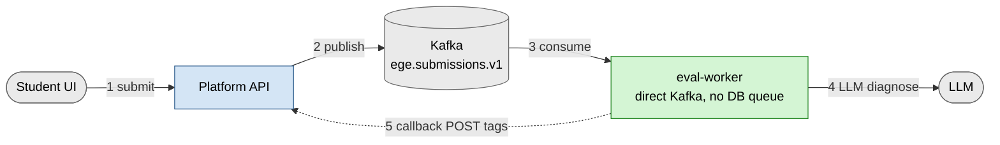
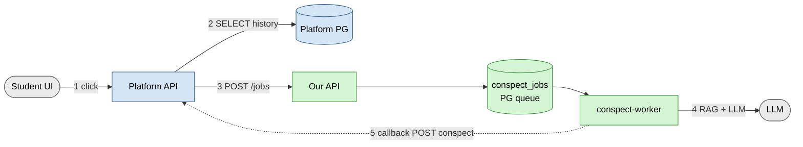

# API specs

Контракты интеграции с ЕГЭ-платформой (Proryv-backend).

| Файл | Реализует | Вызывает |
|---|---|---|
| [`generator.openapi.yaml`](generator.openapi.yaml) | мы | платформа |
| [`platform.openapi.yaml`](platform.openapi.yaml) | платформа | мы (callbacks) |
| [`kafka_submission_event.schema.yaml`](kafka_submission_event.schema.yaml) | платформа (producer) | мы (consumer) |

Сервис **stateless по user-данным** — source of truth — платформа.

## Flow 1 · Submission tagging



`eval-worker` reads with consumer group `ege-eval-worker`, commits the offset
only after the platform callback succeeds. A transient failure leaves the
offset uncommitted so Kafka redelivers the batch.

## Flow 2 · Conspect generation



## Идемпотентность

| Операция | Направление | Ключ |
|---|---|---|
| `POST /jobs` | платформа → нам | `body.job_id` |
| `POST .../diagnostic-tags` | мы → платформе | `Idempotency-Key = submission_id` |
| `POST /v1/personal-conspect` | мы → платформе | `Idempotency-Key = job_id` |

5xx → ретраим до 3 раз с exponential backoff. 4xx → mark failed, без ретраев.

## Аутентификация

S2S **JWT с shared secret (HS256)**. Платформа передаёт Bearer на `POST /jobs`;
наши workers — Bearer на callback'и. Секрет один и тот же с обеих сторон,
ротация — через выкатку нового `PLATFORM_AUTH_TOKEN`.

## Endpoints, которые мы НЕ реализуем

Из исходного дизайн-дока платформы — для MVP не нужны (всё считается у нас в
памяти из присланных submissions): `/v1/analytics/*`, `/v1/graph/*`,
`/v1/personal-conspect/seen`, `/review-queue`, `/feedback`, `/view`,
EXT-доработки `/competence/*`, `/submission/list`, `/task/list/module`.

## Просмотр / codegen

```bash
# Swagger UI
docker run -p 8080:8080 -v $(pwd)/app/spec:/spec swaggerapi/swagger-ui

# Python httpx-клиент к платформе
openapi-python-client generate --path app/spec/platform.openapi.yaml

# TypeScript-клиент к нашему API (для платформы)
npx openapi-typescript app/spec/generator.openapi.yaml -o api-types.ts
```
